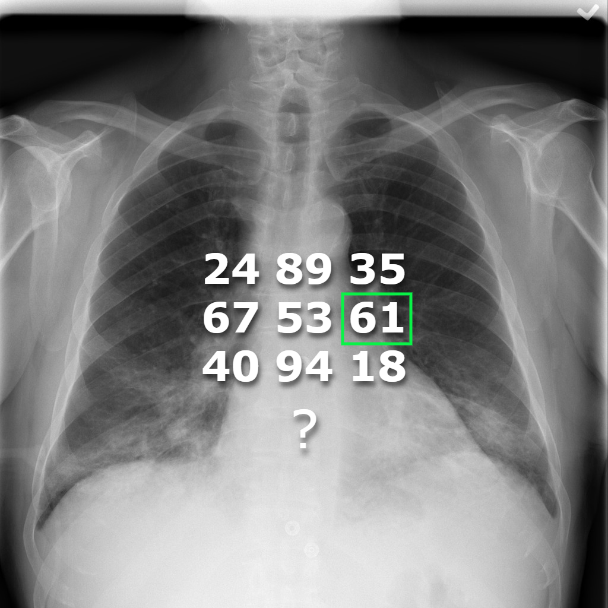
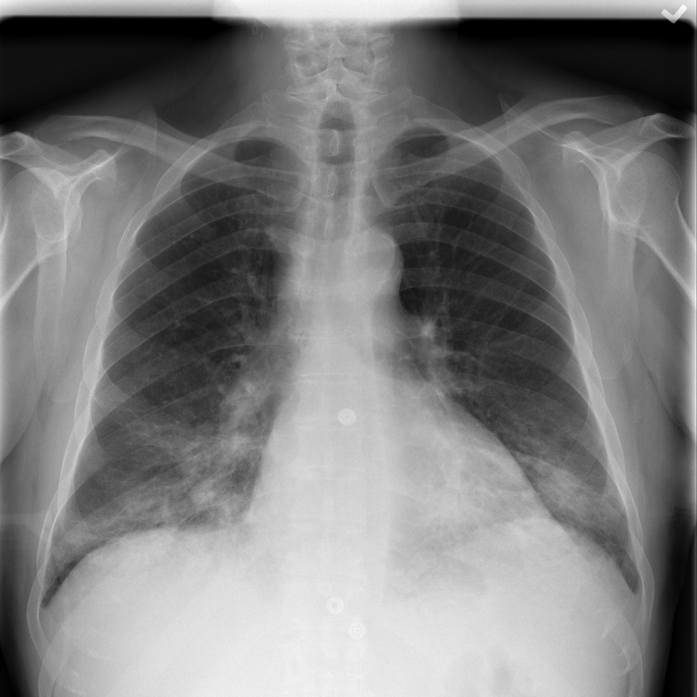

<h2 align="center">Technion's Deep Learning (046211) Project
</h2> 

  

<h4 align="center">
    Iggy Segev Gal:
  
  
    
</a>

<h4 align="center">
    Eyal Gilron:
  
  
    
</a>

Table Of Contents
--
* [Background](#background)
* [File Tree](#file-tree)
* [Installation Instructions](#installation-instructions)
* [Dataset](#dataset)
* [Architectures](#architectures)
* [Results](#results)
  * [Densenet with Imagenet](#Densenet-with-Imagenet)
  * [Densenet with chesXnet](#Densenet-with-chesXnet)
  * [Dino](#Dino)
* [Refrences](#refrences)

## Background
In this project we used the NIH-chest-X-rays dataset for age estimation from chest X-rays, we tested both classification and regression tasks, and two different models - Densenet121 and Dino. With Densenet, we tested two different weight initializations from models trained on Imagenet and chesXnet. We found the best hyper-parameters for each combination. We also tested how much of the data can be reducted and still maintain good results.

## File Tree
|File Name | Purpose |
|----------|---------|
|`config.py`|This file holds all of the project's different configurations, parameters such as: which model to currently to train, different number of blocks to unfreeze, datasize choices, learning rate, regression or classification etc.|
|`resizer.py`| Resizes the images to 224x224 and saves in new folder for faster training.|
|`train.py`| The main part of the code, this files loads the dataset, performs the training and then evaluates the results.|
|`Dataloader.py`| Data loader for the NIH-chest x-ray with age estimation for both classification and regression|
|`dino.py`| This file contains the dino model class|
|`test.py`| This file does the inference on the test set given a trained model |

## Installation Instructions

1. Get Anaconda with Python 3, follow the instructions according to your OS (Windows/Mac/Linux) at: https://www.anaconda.com/download
2. Install the basic packages
3. Install the required libraries according to the table below (to search for a specific library and the corresponding command you can also look at https://anaconda.org/)

## Libraries to Install

|Library         | Command to Run |
|----------------|---------|
|`numpy`|  `conda install -c conda-forge numpy`|
|`matplotlib`|  `conda install -c conda-forge matplotlib`|
|`pandas`|  `conda install -c conda-forge pandas`|
|`scikit-learn`|  `conda install -c conda-forge scikit-learn`|
|`seaborn`|  `conda install -c conda-forge seaborn`|
|`opencv`| `conda install -c conda-forge opencv`|
|`pytorch` (cpu)| `conda install pytorch torchvision torchaudio cpuonly -c pytorch` (<a href="https://pytorch.org/get-started/locally/">get command from PyTorch.org</a>)|
|`pytorch` (gpu)| `conda install pytorch torchvision torchaudio pytorch-cuda=11.8 -c pytorch -c nvidia` (<a href="https://pytorch.org/get-started/locally/">get command from PyTorch.org</a>)|

4. open python and run config.py

## Dataset
The dataset We used the dataset “NIH Chest X-rays” dataset which has 112,120 frontal view chest X-ray images of 30,805 different patients.
We only took one image per patient and only from patients whose ages are in the range of 20-70.
The data consists of 1024x1024 pixel images.
Number of examples per label in classification:
|Label Name |# Training Examples|
|-----------|-------------------|
|20-30|3707|
|30-40|4892|
|40-50|6319|
|50-60|7138|
|60-70|4721|

Example of chest X-ray image from the dataset:

## Architectures
For this classification task we trained a few different models to perform the task, the models we used are:
* Densenet121 with Imagenet
* Densenet121 with chesXnet
* Dinov2 - ViT-S/14 distilled

## Results

### Densenet with Imagenet
Regression:

  
   

Classification:

  
   

Final Test Accuracy = 

### Densenet with chesXnet
Regression:

  
   

Classification:

  
   

Final Test Accuracy = 

### Dino
Regression:

  
   

Classification:

  
   

Final Test Accuracy = 

## Refrences
[1] NIH Dataset: https://www.kaggle.com/datasets/nih-chest-xrays

[2] chesXnet Model: https://github.com/arnoweng/CheXNet

[3] Dino Model: https://github.com/facebookresearch/dinov2

[4] Idea from: https://www.nature.com/articles/s43856-022-00220-6

